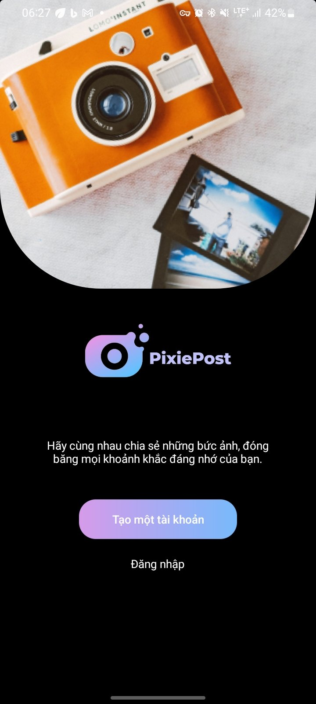
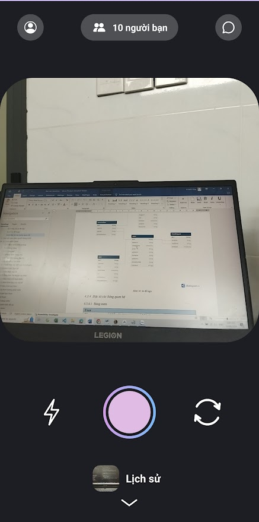
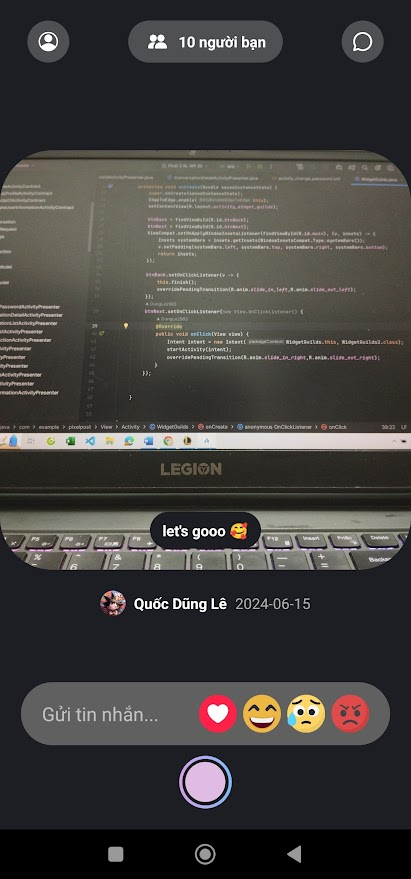
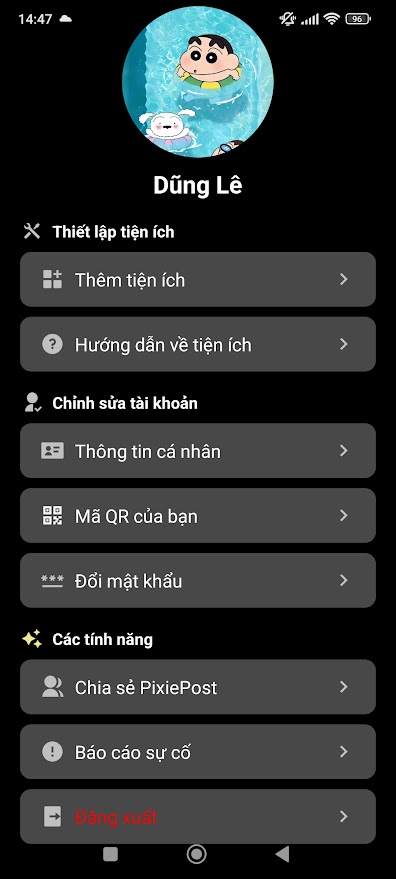
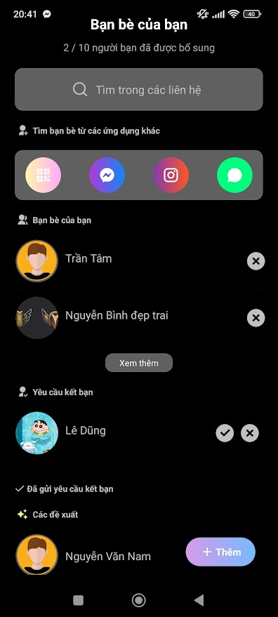
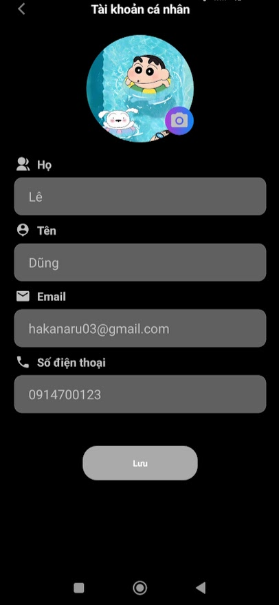
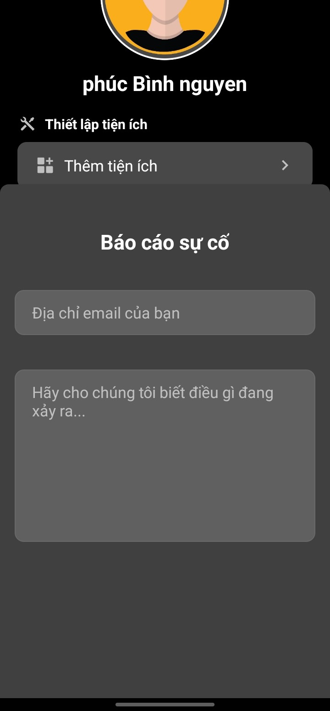
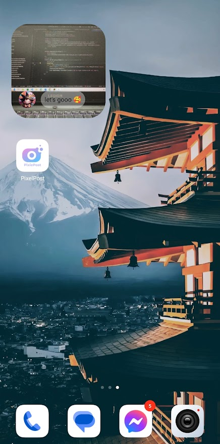

#  PixiePost 
PixiePost is a photo sharing app that focuses on creating a safe and private space for users to share and connect through memorable moments. It emphasizes interactivity and allows users to easily share photos, interact through icons, and engage in messaging.

## Features

- Create Posts and photo sharing.
- Interactive icons.
- Messaging and reply posts.
- Friend connection via QR code.
- Widget screen.
- Manage profile.
- Send reports/feedback to admin.
- And other engaging features.

## Requirement

- Runtime environment:
    - Java Runtime Environment (JRE) 8 or above.
    - Firebase Storage for file storage.
    - Android Virtual machine or physical device for testing the app.

- Development environment:
    - Java Development Kit (JDK) 8 or above.
    - Android Studio for developing the user interface and app functionality.
    - Firebase Storage for file storage.
    - Android Virtual Device (AVD) in Android Studio or a physical device for testing the app.

## Installation Guide

To install and run the project locally, follow these steps:

1. Clone this repo.
2. Install all the dependencies.
3. Set up an Android Virtual Device (AVD) or physical Android device
4. Start building our Android app.

## User Interface

## Authors

[Lê Quốc Dũng](https://github.com/DungLe2983)

[Nguyễn Phúc Bình](https://github.com/leesoonduck3009)

[Trần Đình Tâm](https://github.com/thanhpt1110)
